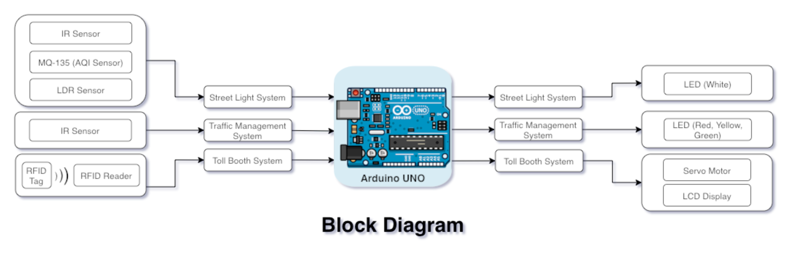
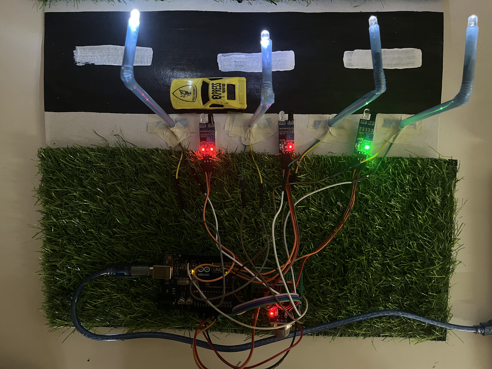

# Road-Management-System
#### The aim of this project is to study the traffic congestion, waiting time, excessive wastage of energy and power problems caused by the traditional systems and develop a street administration and brilliance management system

## Smart Density Based Traffic Management System

## Smart Street Light System

## Toll Management System

